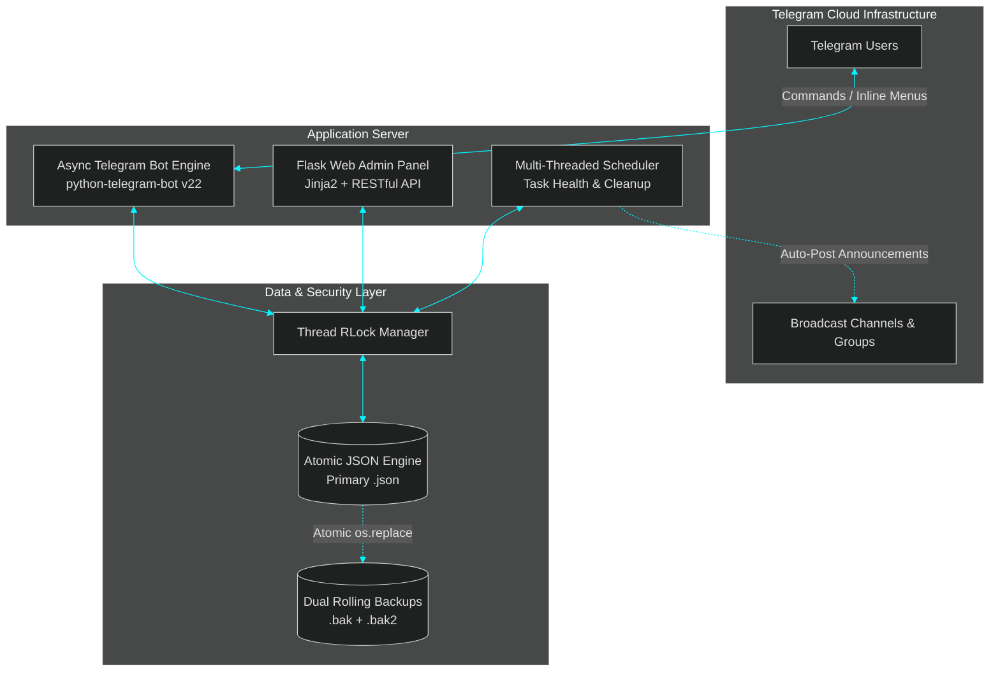

<div align="center">

<!-- Cyber Dark OLED Header Banner -->


<!-- Dynamic Glowing Neon Typing SVG -->
<a href="https://github.com/lusufer-rohit/refer-and-earn-telegram-bot-with-redeem-point-system">
  
</a>

<p align="center">
  
  
  
  
  
</p>

---

</div>

## 📌 Executive Architecture Summary

**Telegram OTT Distribution & Redeem Engine** is an asynchronous, high-throughput backend ecosystem combining an interactive Telegram user bot with an administrative **Flask Web Panel** and a background automation scheduler.

Engineered for reliable digital inventory distribution, referral commission ledgers, account exchanges, and scheduled channel broadcasts with **zero external DBMS overhead**.



---

## ⚡ Core Systems & Feature Matrix

### 🤖 1. Asynchronous Telegram User Bot
- **Interactive Inline Navigation**: Dynamic keyboard markup with animated status visualizers (`animations.py`).
- **Referral & Points Engine**: Multi-tier referral tracking, anti-abuse checks, and automated daily reward streaks.
- **Digital Account Redemption**: Instant digital account drop with quota caps, cooldowns, and category filtering.
- **Promotional Gift Codes**: Generate and redeem usage-capped or time-limited bonus codes.
- **Account Exchange Pipeline**: Peer submission pipeline for account swaps requiring admin verification.

### 🎛️ 2. Flask Administrative Web Portal
- **Real-Time Analytics**: Visual dashboard tracking registered users, active drops, referral traffic, and system logs.
- **Account Inventory Manager**: Batch upload, categorize, inspect, and delete digital accounts.
- **Campaign Broadcaster**: HTML/Markdown broadcast engine targeting specific user segments or public channels.
- **Audit & Exchange Approval**: Approve or reject pending account submissions with direct DM notifications.

### 🛡️ 3. Fault-Tolerant Atomic Storage
- **Thread-Safe Concurrency**: Concurrency managed via re-entrant thread locks (`threading.RLock`) across simultaneous Web & Bot threads.
- **Crash-Proof Atomic Write Protocol**: Writes staging buffers (`.tmp`), flushes file descriptors (`fsync`), and atomically replaces disk pointers (`os.replace`).
- **Continuous Rolling Rotation**: Always maintains `.bak` (previous state) and `.bak2` (fallback state) to eliminate data loss.
- **Zero Hardcoded Secrets**: Complete `.env` decoupling prevents credential leakage.

---

## 🛠️ Technology Stack

| Domain | Technology | Purpose |
|---|---|---|
| **Language** | Python 3.11+ | Primary high-performance asynchronous runtime |
| **Bot Framework** | `python-telegram-bot` 22.2 | Async event loop, inline menus, callbacks |
| **Web Framework** | Flask 3.1.0 + Jinja2 | Administrative interface & REST API endpoints |
| **Persistence** | Atomic JSON Storage Engine | Low-latency storage with thread locks & backups |
| **Scheduler** | Python Multi-threading | Background verification, channel hygiene, sync |
| **Security** | Environment Decoupling | Complete separation of tokens, secrets, and data |

---

## 🚀 Quickstart & Setup Guide

### 1. Clone & Enter Directory
```bash
git clone git@github.com:lusufer-rohit/refer-and-earn-telegram-bot-with-redeem-point-system.git
cd refer-and-earn-telegram-bot-with-redeem-point-system
```

### 2. Configure Virtual Environment
```bash
python -m venv venv

# Windows (PowerShell / CMD)
venv\Scripts\activate

# Linux / macOS
source venv/bin/activate
```

### 3. Install Dependencies
```bash
pip install -r requirements.txt
```

### 4. Configure Environment Variables
Copy `.env.example` to `.env` and fill in your secrets:
```bash
cp .env.example .env
```

```ini
# Telegram Bot Token from @BotFather
TOKEN=your_telegram_bot_token_here

# Base URL for Web Panel (no trailing slash)
WEB_APP_URL=https://your-domain.com

# Channel ID for logs/announcements
CHANNEL_ID=-100xxxxxxxxxx

# Admin IDs & Usernames
ADMIN_IDS=123456789
ADMIN_USERNAMES=@your_username

# Web Admin Panel Credentials
WEB_ADMIN_USERNAME=admin
WEB_ADMIN_PASSWORD=your_secure_password
```

### 5. Launch Application
```bash
# Runs both the Telegram Bot and Flask Web Panel concurrently
python app.py
```
*Or on Windows, launch directly via `start.bat`.*

---

## 🌐 Web Admin Panel Endpoints

| Route | Method | Access | Description |
|---|---|---|---|
| `/` | `GET` | Public | Home landing page / WebApp entry |
| `/login` | `GET, POST` | Public | Secure admin authentication portal |
| `/dashboard` | `GET` | Admin | Real-time statistics, active users, metrics |
| `/users` | `GET` | Admin | User database, referral tree & points editor |
| `/accounts` | `GET, POST` | Admin | Digital inventory drop manager |
| `/broadcast` | `GET, POST` | Admin | Multi-channel & direct message broadcaster |
| `/exchanges` | `GET, POST` | Admin | Peer account exchange verification queue |
| `/codes` | `GET, POST` | Admin | Promotional gift code generation system |

---

## 📁 Repository Blueprint

```
├── app.py                     # Master launcher (Spawns Bot + Flask Server)
├── bot.py                     # Telegram Bot builder & core command routing
├── handlers.py                # Message handlers, inline callbacks & admin queries
├── user_handlers.py           # User-facing points, referral & redemption logic
├── database.py                # Thread-safe atomic JSON engine with dual backups
├── config.py                  # Dynamic .env loader & sanitized configuration
├── scheduler.py               # Periodic tasks, background health check & cleanups
├── notifications.py           # Broadcasting engine & direct notification dispatch
├── utils.py                   # Data sanitizers, validators & utility helpers
├── animations.py              # Visual message formatting & bot animations
├── templates/                 # Glassmorphic web panel templates
│   ├── dashboard.html         # Live telemetry & charts
│   ├── accounts.html          # Digital account inventory manager
│   ├── users.html             # User database & points controller
│   └── broadcast.html         # Multi-target broadcast interface
├── static/                    # Cascading style sheets & web assets
├── .env.example               # Safe environment template
├── requirements.txt           # Python dependency manifest
└── README.md                  # Comprehensive dark-mode documentation
```

---

## 🔒 Security & Version Control Notice

- **Database Protection**: All user databases, chat logs, account inventories, and backups are strictly ignored by `.gitignore`.
- **Zero Token Leakage**: Hardcoded credentials are fully deprecated in favor of dynamic `.env` injection.

---

## 👤 Author & Architecture

Architected by **[@lusufer-rohit](https://github.com/lusufer-rohit)**  
*Full-Stack Engineer & Automation Architect*

<div align="center">

<p>
  <a href="https://github.com/lusufer-rohit"></a>
  <a href="https://t.me/"></a>
</p>

<!-- Dark Wave Footer -->


</div>