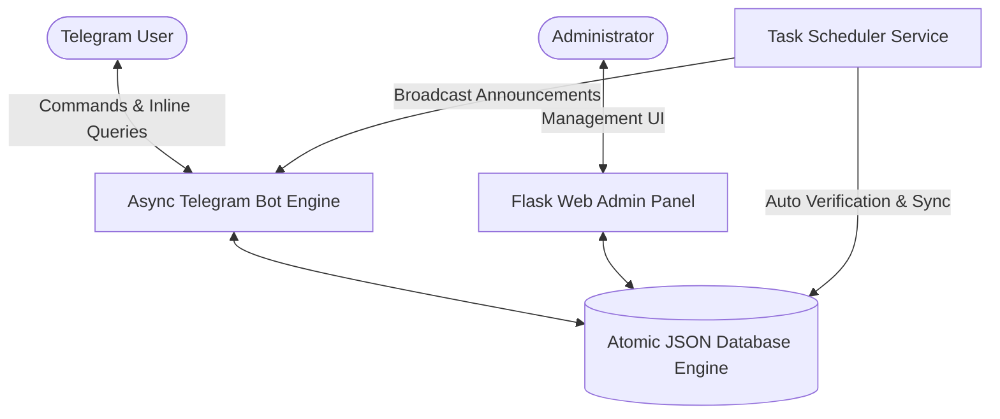

<div align="center">

<!-- Banner Header -->


<!-- Dynamic Typing SVG -->
<a href="https://github.com/lusufer-rohit">
  
</a>

<p align="center">
  
  
  
  
  
</p>

---

</div>

## 📌 Project Overview

**Telegram OTT Distribution Engine** is a production-grade, asynchronous ecosystem combining a high-throughput **Telegram Bot** with a modern **Flask Web Admin Dashboard** and an automated background task scheduler.

Designed for scalable digital asset giveaways, reward points programs, user referrals, and automated distribution without reliance on heavy external DBMS setups.



---

## ⚡ Key Highlights & Features

### 🤖 1. Asynchronous Telegram Bot
- **Interactive UI**: Rich inline keyboard menus with animated status responses.
- **Points & Referral Economy**: Multi-tier referral tracking, fraud prevention, and daily check-in streaks.
- **Account Claiming & Giveaways**: Automated inventory distribution with quota caps and cooldown periods.
- **Gift Code Generator**: Time-limited and usage-capped promotional codes redeemable via bot.
- **Account Exchanges**: User-to-admin account exchange submission with approval queue.

### 🎛️ 2. Web Administration Panel
- **Real-time Dashboard**: Live metrics on registered users, active tasks, inventory levels, and broadcasts.
- **Inventory Management**: Upload, categorize, batch-edit, and monitor digital account drops.
- **Broadcast System**: Filtered broadcast campaigns across multiple channels and private user chats.
- **User Activity Audit**: Granular log of referrals, points history, claimed rewards, and redemptions.

### 🛡️ 3. Robust Data Architecture
- **Thread-Safe Atomic Writes**: Prevents corruption with thread re-entrant locks (`RLock`), temporary staging files, and filesystem sync (`fsync`).
- **Dual-Layer Auto Backup**: Continuous rolling rotation (`.bak` and `.bak2`) to guarantee zero data loss.
- **Safe Environment Decoupling**: Sensitive credentials, tokens, and admin passwords are completely isolated in environment variables.

---

## 🛠️ Tech Stack & Dependencies

| Layer | Technologies |
|---|---|
| **Core Language** | Python 3.11+ |
| **Telegram Framework** | `python-telegram-bot` (v22.2 async) |
| **Web Server** | Flask 3.1, Jinja2 Templates, HTML5/CSS3 |
| **Database & Cache** | Custom Atomic JSON Storage Engine & Thread Locks |
| **Task Automation** | Asynchronous Multi-threaded Scheduler |
| **Security & Config** | Environment Variables, PBKDF2/SHA256 Auth Hashing |

---

## 🚀 Quickstart & Installation

### 1. Clone Repository
```bash
git clone git@github.com:lusufer-rohit/refer-and-earn-telegram-bot-with-redeem-point-system.git
cd refer-and-earn-telegram-bot-with-redeem-point-system
```

### 2. Configure Virtual Environment
```bash
python -m venv venv
# Windows:
venv\Scripts\activate
# Linux/macOS:
source venv/bin/activate
```

### 3. Install Requirements
```bash
pip install -r requirements.txt
```

### 4. Setup Environment Variables
Copy `.env.example` to `.env` and configure your credentials:
```bash
cp .env.example .env
```

Edit `.env`:
```ini
TOKEN=your_telegram_bot_token_here
WEB_APP_URL=https://your-domain.com
CHANNEL_ID=-100xxxxxxxxxx
ADMIN_IDS=123456789
ADMIN_USERNAMES=@your_username
WEB_ADMIN_USERNAME=admin
WEB_ADMIN_PASSWORD=your_secure_password
```

### 5. Launch the Bot & Web Panel
```bash
# Run both bot and web panel simultaneously
python app.py
```
Or use the provided automated script:
```bash
# Windows
start.bat
```

---

## 📁 Repository Structure

```
├── app.py                     # Main application entrypoint (Bot + Web server)
├── bot.py                     # Telegram bot setup & core command dispatcher
├── handlers.py                # Message, inline query & callback query handlers
├── user_handlers.py           # User-facing flow & points management
├── database.py                # Atomic data engine with thread-safe backup rotation
├── config.py                  # Environment loader & system configuration
├── scheduler.py               # Background task scheduler & health check
├── notifications.py           # User notification & channel broadcast engine
├── utils.py                   # Helper utilities, sanitizers & validators
├── animations.py              # Visual message formatting & bot animations
├── templates/                 # Web admin panel Jinja2 templates
│   ├── dashboard.html         # Live overview & statistics
│   ├── accounts.html          # Inventory manager
│   ├── users.html             # User database & points editor
│   └── broadcast.html         # Channel & DM broadcasting interface
├── static/                    # CSS stylesheets, icons & web assets
├── .env.example               # Safe environment template
├── requirements.txt           # Python dependencies
└── README.md                  # Project documentation
```

---

## 🔒 Security & Privacy Notice

- **Zero Hardcoded Secrets**: All tokens, admin passwords, and IDs are read dynamically from `.env` or system environment.
- **Gitignore Protection**: User database files, session logs, transaction logs, and credentials are strictly blacklisted from version control.

---

## 👤 Author

Developed with care by **[@lusufer-rohit](https://github.com/lusufer-rohit)**  
*Full-Stack Engineer & Automation Architect*

<div align="center">

<p>
  <a href="https://github.com/lusufer-rohit"></a>
  <a href="https://t.me/"></a>
</p>

<!-- Footer Banner -->


</div>
